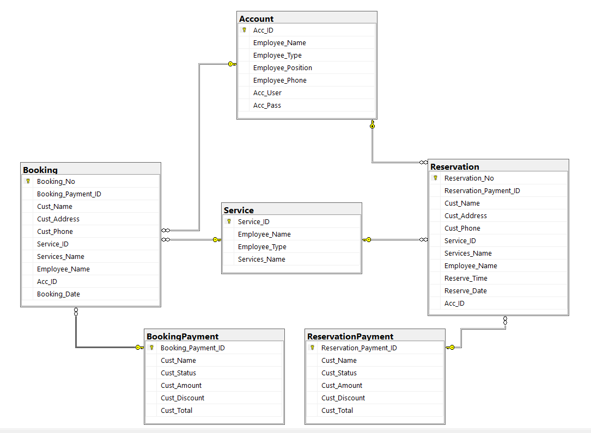

# GUI Preview
    

# ER Diagram

# About the developer

Front End and Back End Developer: Raegan Faith Paguirigan

I utilized Eclipse for the development of my GUI(Graphic User Interface) and for the development and customization of Icons, I used Adobe Illustrator. Microsoft SQL Server Management Studio 18 is the software I used for the database. This is a project in one of my majors when I was 2nd year college, and it is supposed to be a project of 4 members but I decided to do it solo to challenge myself.  
