# GUI Preview and System Description
  A desktop system that is utilized for the accumulation of transaction process and data in a typical Beauty Salon. Data records of the transactions are stored in the back-end(SQL)  of  the  system.  The front-end(GUI)  will  then  display  and  read  the  data  in  the user Interface of the system. The main features of this system are to manage the payment of the booking and reservation transactions in the Salon. The system can be accessed and  managed  by  the  admin  and  added  users  for the  convenience  of  managing  and recording  transactions. There  are  3  default  accounts  that  can  login  and  access  the system. Each role of the users hasdifferent accessibility of the features of the TPS. 
  
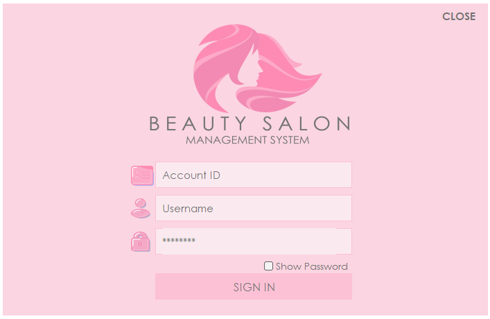

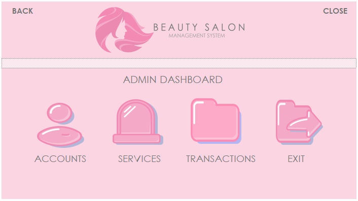

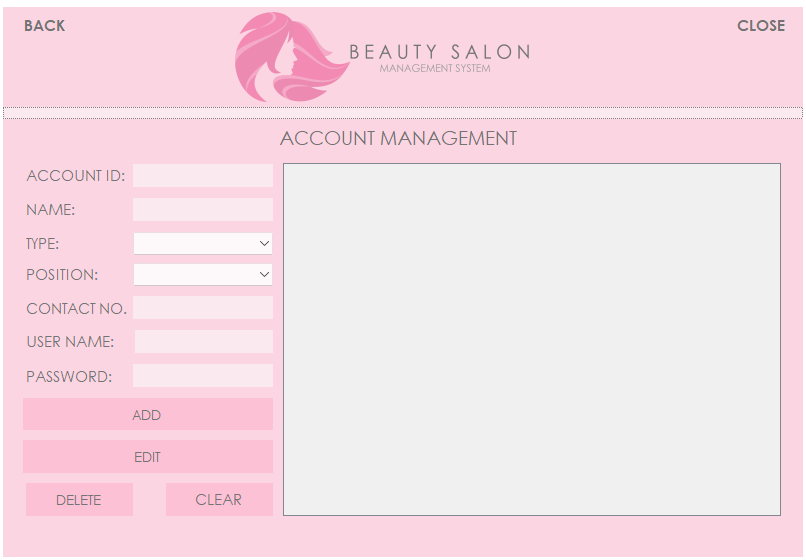

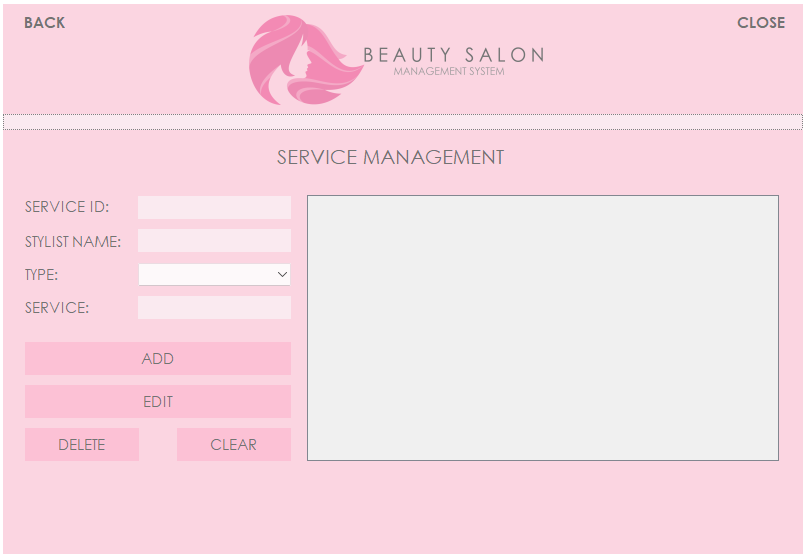

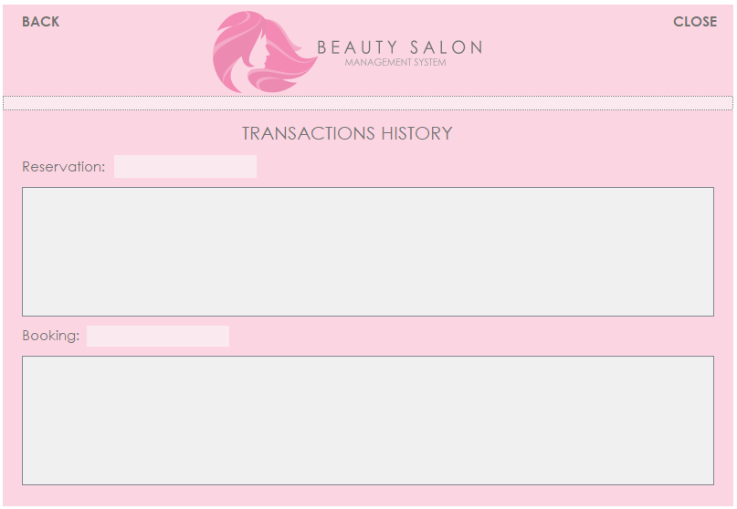

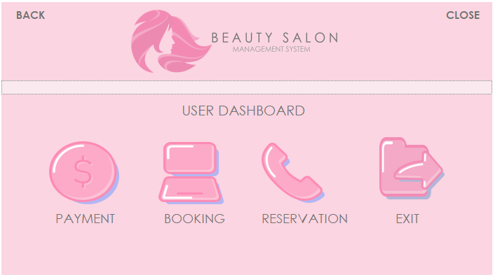

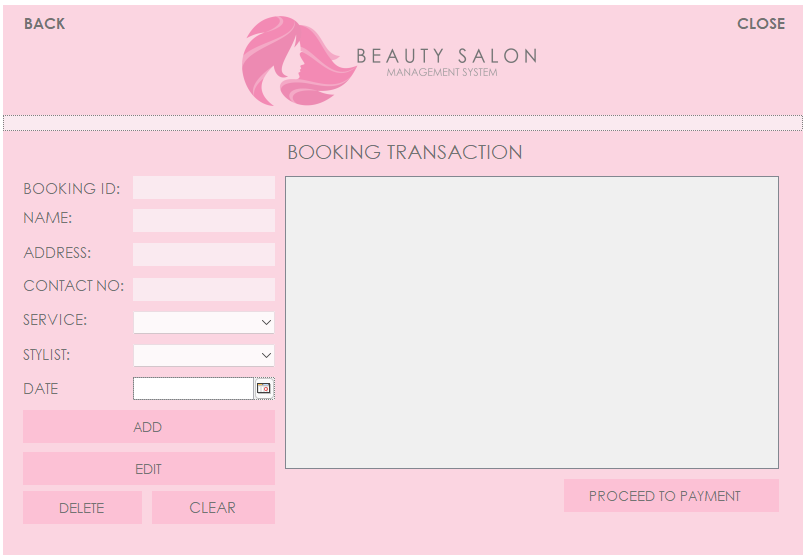

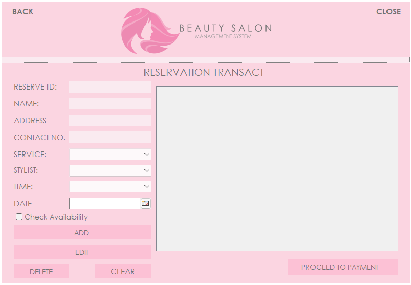

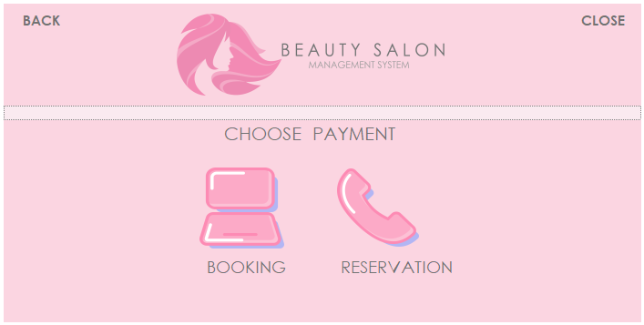

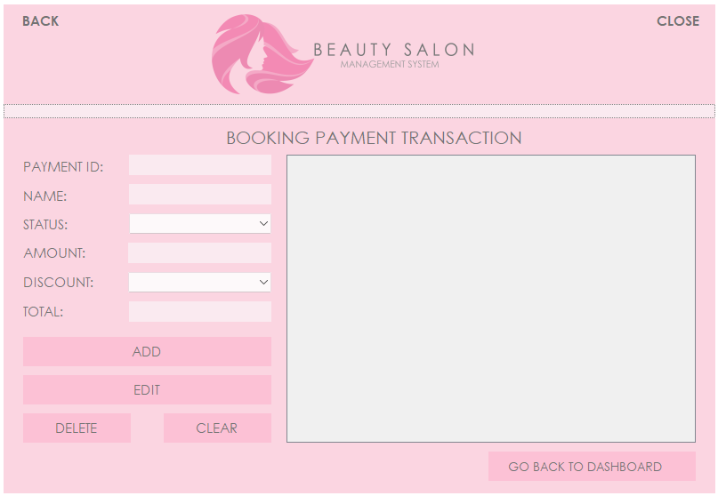

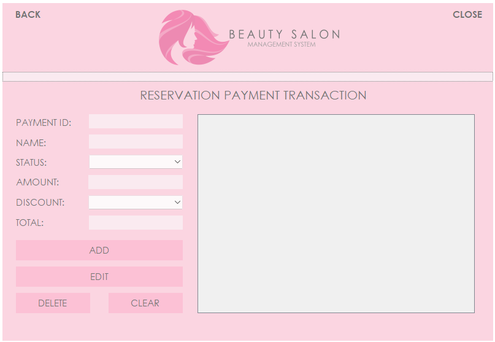

# ER Diagram

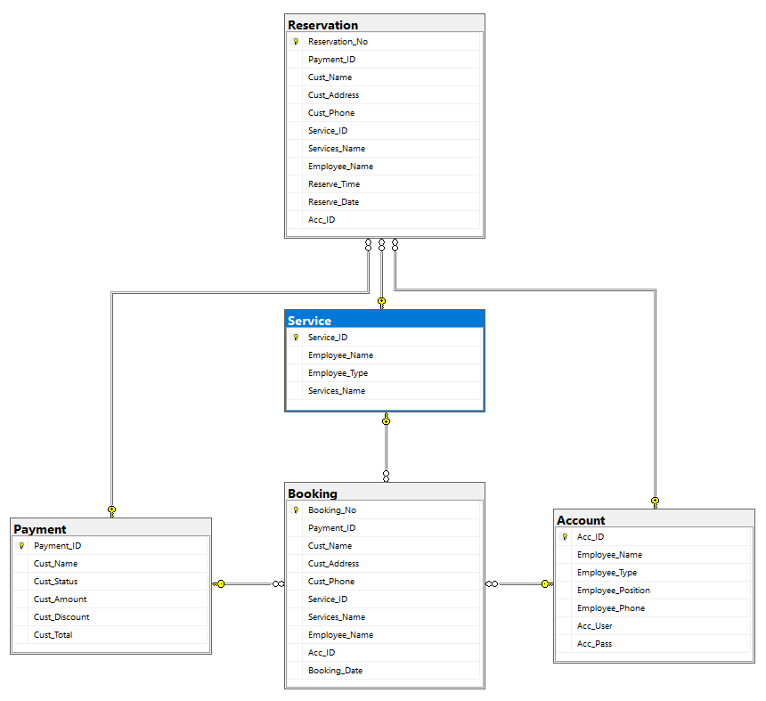
